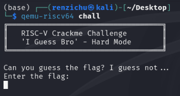
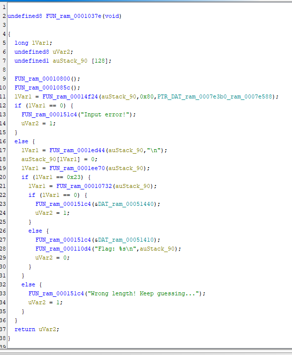
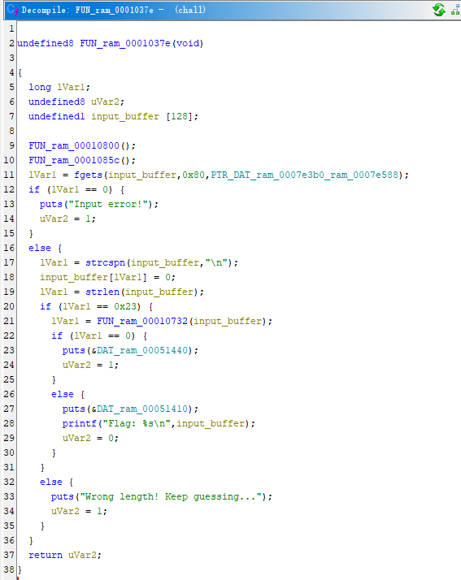
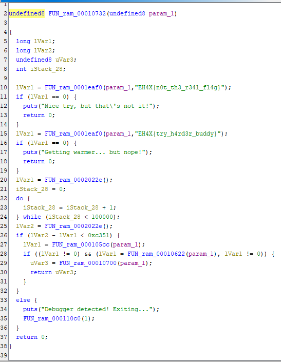
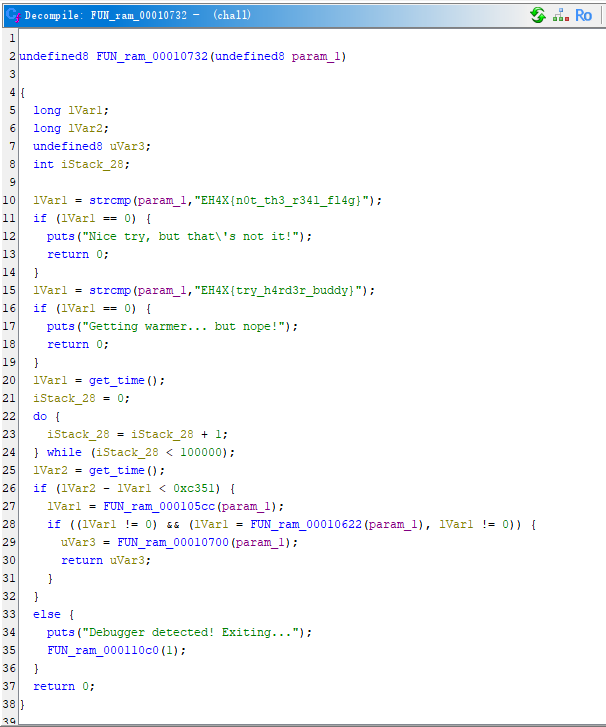
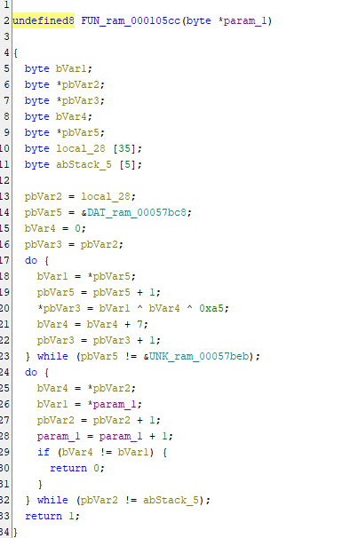
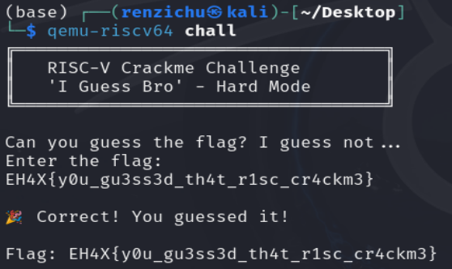

# i guess bro



启动后发现这是一个flag校验程序。







分析主程序，FUN_ram_00014f24应该是fgets，那auStack_90就是输入缓存区，接下来删除换行符，校验flag长度是否为0x23，经过FUN_ram_00010732处理之后检查是否正确，那么FUN_ram_00010732应该就是需要进一步分析的函数。





20-26行通过时间检测是否是反调试，然后FUN_ram_000105cc，FUN_ram_00010622，FUN_ram_00010700三个函数都用到了输入，首先查看FUN_ram_000105cc这个函数。



根据加密函数反推出解密脚本

```python
cipher = [
    0xe0, 0xea, 0x9f, 0xe8, 0xc2, 0xff, 0xbf, 0xe1,
    0xc2, 0xfd, 0x96, 0xdb, 0x82, 0x8d, 0xf4, 0xa8,
    0x8a, 0xa6, 0xb3, 0x14, 0x5d, 0x69, 0x4d, 0x35,
    0x7e, 0x69, 0x4c, 0x7b, 0x13, 0x5a, 0x14, 0x17,
    0x28, 0x71, 0x36
]

bVar4 = 0
key = 0xa5
flag = ""

for b in cipher:
    decrypted_byte = b ^ bVar4 ^ key

    flag += chr(decrypted_byte)

    bVar4 = (bVar4 + 7) & 0xFF

print("破解出的明文是:", flag)
```

最后flag为EH4X{y0u_gu3ss3d_th4t_r1sc_cr4ckm3}



